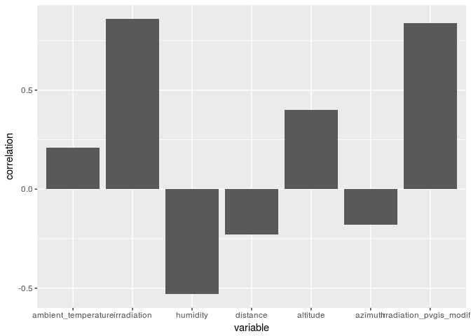
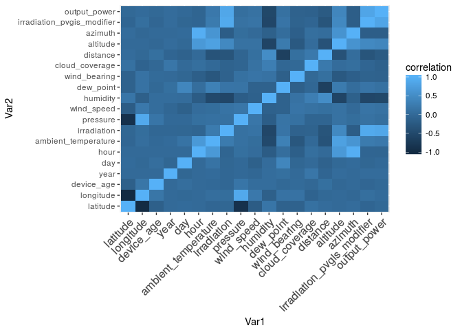

```r
library(dplyr)
library(ggplot2)
library(reshape2)
library(caret)
```


## Data analysis

This analysis was performed over photovoltaics data that was gathered from three neighboring solar plants in Italy.
The data comes from sensors placed next to the photovoltaic panels. Each row in the dataset contains average information from one hour of measurements of a single solar panel. With weather and geographical information, the goal was to find the attributes that best predict the energy produced by a given unit.
Most relevant attributes were found to be irradiation (mostly), humidity, distance from the sun and altitude. Some of these attributes are highly correlated to others (such as day to distance from the sun). 


```r
set.seed(1337)
```

## Load data

Loading data from "data.csv" file:

```r
data_raw <- read.csv("data.csv", stringsAsFactors = FALSE)
df_raw <- tbl_df(data_raw)
df_raw
```

```
## # A tibble: 235,790 x 51
##        id idsito idmodel idbrand   lat   lon ageinmonths  anno     day
##     <int>  <dbl>   <dbl>   <dbl> <dbl> <dbl>       <dbl> <int>   <dbl>
##  1  97595 0.425   0.0830  0.0830 0.437 0.631      1.00    2012 0.00300
##  2  97606 0.250   0.208   0.0830 0.437 0.620      0.0630  2012 0.00300
##  3  97637 0.350   0.375   0      0.439 0.626      0       2012 0.00300
##  4  97646 0.325   0.292   0.167  0.440 0.612      0.250   2012 0.00300
##  5  97772 0       0       0.333  0.436 0.626      0.719   2012 0.00300
##  6 104492 0.375   0.417   0      0.552 0.154      0.125   2012 0.00300
##  7 104528 0.400   0.458   0      0.553 0.160      0.125   2012 0.00300
##  8 104601 0.125   0.167   0.167  0.415 0.691      0       2012 0.00300
##  9 104637 0.225   0.208   0.0830 0.437 0.620      0.0630  2012 0.00300
## 10 169235 0.0750  0.0830  0.0830 0.437 0.624      1.00    2012 0.00300
## # ... with 235,780 more rows, and 42 more variables: ora <dbl>,
## #   data <chr>, temperatura_ambiente <dbl>, irradiamento <dbl>,
## #   pressure <dbl>, windspeed <dbl>, humidity <dbl>, icon <dbl>,
## #   dewpoint <dbl>, windbearing <dbl>, cloudcover <dbl>, tempi <dbl>,
## #   irri <dbl>, pressurei <dbl>, windspeedi <dbl>, humidityi <dbl>,
## #   dewpointi <dbl>, windbearingi <dbl>, cloudcoveri <dbl>, dist <dbl>,
## #   altitude <dbl>, azimuth <dbl>, altitudei <dbl>, azimuthi <dbl>,
## #   pcnm1 <dbl>, pcnm2 <dbl>, pcnm3 <dbl>, pcnm4 <dbl>, pcnm5 <dbl>,
## #   pcnm6 <dbl>, pcnm7 <dbl>, pcnm8 <dbl>, pcnm9 <dbl>, pcnm10 <dbl>,
## #   pcnm11 <dbl>, pcnm12 <dbl>, pcnm13 <dbl>, pcnm14 <dbl>, pcnm15 <dbl>,
## #   irr_pvgis_mod <dbl>, irri_pvgis_mod <dbl>, kwh <dbl>
```

## Data recognition

Mostly, values are normalized, but some of them probably were ommited when data was cleaned (before we put out hands on it).


```r
summary(df_raw)
```

```
##        id             idsito          idmodel          idbrand      
##  Min.   :     1   Min.   :0.0000   Min.   :0.0000   Min.   :0.0000  
##  1st Qu.: 99646   1st Qu.:0.1000   1st Qu.:0.1670   1st Qu.:0.0830  
##  Median :158594   Median :0.2250   Median :0.2080   Median :0.1670  
##  Mean   :152703   Mean   :0.2147   Mean   :0.2426   Mean   :0.1519  
##  3rd Qu.:217541   3rd Qu.:0.3250   3rd Qu.:0.2920   3rd Qu.:0.1670  
##  Max.   :276488   Max.   :0.4250   Max.   :0.7500   Max.   :0.4170  
##       lat              lon          ageinmonths          anno     
##  Min.   :0.4150   Min.   :0.1540   Min.   :0.0000   Min.   :2012  
##  1st Qu.:0.4370   1st Qu.:0.6200   1st Qu.:0.0000   1st Qu.:2012  
##  Median :0.4370   Median :0.6240   Median :0.1250   Median :2012  
##  Mean   :0.4495   Mean   :0.5711   Mean   :0.3145   Mean   :2012  
##  3rd Qu.:0.4390   3rd Qu.:0.6300   3rd Qu.:0.7190   3rd Qu.:2013  
##  Max.   :0.5530   Max.   :0.6910   Max.   :1.0000   Max.   :2013  
##       day              ora            data           temperatura_ambiente
##  Min.   :0.0000   Min.   :0.000   Length:235790      Min.   :0.0450      
##  1st Qu.:0.2520   1st Qu.:0.222   Class :character   1st Qu.:0.2120      
##  Median :0.4770   Median :0.500   Mode  :character   Median :0.3480      
##  Mean   :0.4812   Mean   :0.500                      Mean   :0.3734      
##  3rd Qu.:0.7100   3rd Qu.:0.778                      3rd Qu.:0.5300      
##  Max.   :1.0000   Max.   :1.000                      Max.   :0.8180      
##   irradiamento       pressure        windspeed          humidity     
##  Min.   :0.0000   Min.   :0.0000   Min.   :0.00000   Min.   :0.1600  
##  1st Qu.:0.0000   1st Qu.:0.7480   1st Qu.:0.04200   1st Qu.:0.5400  
##  Median :0.0350   Median :0.7530   Median :0.06600   Median :0.7000  
##  Mean   :0.1091   Mean   :0.6504   Mean   :0.07622   Mean   :0.6844  
##  3rd Qu.:0.2040   3rd Qu.:0.7550   3rd Qu.:0.10200   3rd Qu.:0.8400  
##  Max.   :0.7100   Max.   :0.7690   Max.   :0.69600   Max.   :1.0000  
##       icon           dewpoint       windbearing       cloudcover   
##  Min.   :0.0000   Min.   :0.1390   Min.   :0.0000   Min.   :0.000  
##  1st Qu.:0.0830   1st Qu.:0.5350   1st Qu.:0.3000   1st Qu.:0.230  
##  Median :0.6670   Median :0.6190   Median :0.4780   Median :0.310  
##  Mean   :0.4623   Mean   :0.6055   Mean   :0.4512   Mean   :0.359  
##  3rd Qu.:0.6670   3rd Qu.:0.6830   3rd Qu.:0.6600   3rd Qu.:0.510  
##  Max.   :0.7500   Max.   :0.8650   Max.   :0.7690   Max.   :1.000  
##      tempi             irri         pressurei          windspeedi     
##  Min.   :0.0090   Min.   :0.108   Min.   :0.000000   Min.   :0.00000  
##  1st Qu.:0.0730   1st Qu.:0.216   1st Qu.:0.000000   1st Qu.:0.03700  
##  Median :0.1110   Median :0.220   Median :0.000000   Median :0.03800  
##  Mean   :0.1225   Mean   :0.222   Mean   :0.000237   Mean   :0.03852  
##  3rd Qu.:0.1260   3rd Qu.:0.222   3rd Qu.:0.000000   3rd Qu.:0.03900  
##  Max.   :0.9830   Max.   :1.000   Max.   :1.000000   Max.   :1.00000  
##    humidityi         dewpointi       windbearingi     cloudcoveri    
##  Min.   :0.03400   Min.   :0.0630   Min.   :0.0000   Min.   :0.0000  
##  1st Qu.:0.04400   1st Qu.:0.1140   1st Qu.:0.3360   1st Qu.:0.1960  
##  Median :0.04400   Median :0.1140   Median :0.3360   Median :0.1960  
##  Mean   :0.06384   Mean   :0.1194   Mean   :0.3455   Mean   :0.2062  
##  3rd Qu.:0.06200   3rd Qu.:0.1180   3rd Qu.:0.3390   3rd Qu.:0.1980  
##  Max.   :0.57900   Max.   :0.4150   Max.   :1.0000   Max.   :1.0000  
##       dist           altitude         azimuth         altitudei     
##  Min.   :0.0000   Min.   :0.1110   Min.   :0.1280   Min.   :0.0000  
##  1st Qu.:0.1913   1st Qu.:0.4190   1st Qu.:0.2950   1st Qu.:0.0960  
##  Median :0.4590   Median :0.5640   Median :0.4250   Median :0.1360  
##  Mean   :0.4686   Mean   :0.5464   Mean   :0.4546   Mean   :0.2055  
##  3rd Qu.:0.7268   3rd Qu.:0.6810   3rd Qu.:0.6350   3rd Qu.:0.2660  
##  Max.   :1.0000   Max.   :0.8840   Max.   :0.8180   Max.   :0.9820  
##     azimuthi          pcnm1            pcnm2            pcnm3       
##  Min.   :0.0000   Min.   :0.0000   Min.   :0.0000   Min.   :0.0000  
##  1st Qu.:0.2090   1st Qu.:0.3770   1st Qu.:0.2500   1st Qu.:0.5510  
##  Median :0.2880   Median :0.3780   Median :0.3770   Median :0.6050  
##  Mean   :0.3653   Mean   :0.4224   Mean   :0.3538   Mean   :0.6045  
##  3rd Qu.:0.4820   3rd Qu.:0.3800   3rd Qu.:0.4220   3rd Qu.:0.7300  
##  Max.   :1.0000   Max.   :1.0000   Max.   :0.9720   Max.   :1.0000  
##      pcnm4            pcnm5            pcnm6            pcnm7       
##  Min.   :0.0000   Min.   :0.0000   Min.   :0.0000   Min.   :0.0000  
##  1st Qu.:0.3630   1st Qu.:0.3310   1st Qu.:0.3390   1st Qu.:0.0310  
##  Median :0.5310   Median :0.4270   Median :0.4930   Median :0.0520  
##  Mean   :0.5189   Mean   :0.4165   Mean   :0.4941   Mean   :0.1142  
##  3rd Qu.:0.6340   3rd Qu.:0.4620   3rd Qu.:0.4930   3rd Qu.:0.1140  
##  Max.   :1.0000   Max.   :1.0000   Max.   :1.0000   Max.   :1.0000  
##      pcnm8            pcnm9            pcnm10           pcnm11      
##  Min.   :0.0000   Min.   :0.0000   Min.   :0.0000   Min.   :0.0000  
##  1st Qu.:0.2040   1st Qu.:0.5270   1st Qu.:0.5530   1st Qu.:0.2570  
##  Median :0.4120   Median :0.5320   Median :0.6190   Median :0.3270  
##  Mean   :0.4034   Mean   :0.5371   Mean   :0.6276   Mean   :0.3236  
##  3rd Qu.:0.5110   3rd Qu.:0.6000   3rd Qu.:0.7170   3rd Qu.:0.3270  
##  Max.   :1.0000   Max.   :1.0000   Max.   :1.0000   Max.   :1.0000  
##      pcnm12           pcnm13           pcnm14           pcnm15      
##  Min.   :0.0000   Min.   :0.1370   Min.   :0.0000   Min.   :0.0000  
##  1st Qu.:0.7480   1st Qu.:0.6140   1st Qu.:0.4320   1st Qu.:0.6120  
##  Median :0.7600   Median :0.6140   Median :0.4730   Median :0.6140  
##  Mean   :0.7568   Mean   :0.6501   Mean   :0.4893   Mean   :0.5709  
##  3rd Qu.:0.8840   3rd Qu.:0.7380   3rd Qu.:0.5300   3rd Qu.:0.6150  
##  Max.   :1.0000   Max.   :1.0000   Max.   :1.0000   Max.   :1.0000  
##  irr_pvgis_mod    irri_pvgis_mod         kwh        
##  Min.   :0.0000   Min.   :-0.0250   Min.   :0.0000  
##  1st Qu.:0.0000   1st Qu.: 0.1580   1st Qu.:0.0000  
##  Median :0.0560   Median : 0.1940   Median :0.0490  
##  Mean   :0.1767   Mean   : 0.1967   Mean   :0.1688  
##  3rd Qu.:0.3250   3rd Qu.: 0.2130   3rd Qu.:0.3320  
##  Max.   :1.0000   Max.   : 1.0060   Max.   :1.0000
```

### Codebook
Attributes:
* id -> integer -> measurement identifier
* idsito -> double -> site id
* idmodel -> double -> panel model id 
* lat -> double -> latitude
* lon -> double -> longitude
* ageinmonths -> double -> device age
* anno -> integer -> year
* day -> double -> day of month (normalized like other values)
* ora -> double -> hour (only 19 uniqe values present)
* data -> character -> date
* temperatura_ambiente -> double -> ambient temperature
* irradiamento -> double -> irradiation
* pressure -> double -> pressure
* windspeed -> double -> wind speed
* humidity dbl humidity NORM 0.16-1
* icon -> double -> maybe normalized icon identifier
* dewpoint -> double -> dew point
* windbearing -> double -> wind bearing (maybe wind direction)
* cloudcover -> double -> sky cloud coverage
... few attributes with "i" suffix
* dist -> double -> distance from sun
* altitude -> double -> altitude
* azimuth -> double -> azimuth
... altitudei and azimuthi -> double -> dbl -> double -> same values as altitude and azimuth but renormalized
* pcnm1..pcnm15 -> double -> unknown attribute
* irr_pvgis_mod -> double -> irradiation data from PVGIS source
* irri_pvgis_mod -> double -> nearly the same as irr_pvgis_mod
* kwh -> double -> output power

## Clean data

At first incomplete rows are filtered out. Then id-like, meta-data and unrecognized columns are ommited. Finally columns are renamed.


```r
df_cleaner <- df_raw %>% na.omit %>%
  select(-(idsito:idbrand), -icon, -(tempi:cloudcoveri), -(altitudei:pcnm15), -irri_pvgis_mod) %>% 
  rename(latitude = lat, longitude = lon, device_age = ageinmonths, year = anno, hour = ora, date = data, ambient_temperature = temperatura_ambiente, irradiation = irradiamento, wind_speed = windspeed, dew_point = dewpoint, wind_bearing = windbearing, cloud_coverage = cloudcover, distance = dist, irradiation_pvgis_modifier = irr_pvgis_mod, output_power = kwh) %>% 
  print
```

```
## # A tibble: 235,790 x 21
##        id latitude longitude device_age  year     day  hour date         
##     <int>    <dbl>     <dbl>      <dbl> <int>   <dbl> <dbl> <chr>        
##  1  97595    0.437     0.631     1.00    2012 0.00300     0 1/2/2012 2:00
##  2  97606    0.437     0.620     0.0630  2012 0.00300     0 1/2/2012 2:00
##  3  97637    0.439     0.626     0       2012 0.00300     0 1/2/2012 2:00
##  4  97646    0.440     0.612     0.250   2012 0.00300     0 1/2/2012 2:00
##  5  97772    0.436     0.626     0.719   2012 0.00300     0 1/2/2012 2:00
##  6 104492    0.552     0.154     0.125   2012 0.00300     0 1/2/2012 2:00
##  7 104528    0.553     0.160     0.125   2012 0.00300     0 1/2/2012 2:00
##  8 104601    0.415     0.691     0       2012 0.00300     0 1/2/2012 2:00
##  9 104637    0.437     0.620     0.0630  2012 0.00300     0 1/2/2012 2:00
## 10 169235    0.437     0.624     1.00    2012 0.00300     0 1/2/2012 2:00
## # ... with 235,780 more rows, and 13 more variables:
## #   ambient_temperature <dbl>, irradiation <dbl>, pressure <dbl>,
## #   wind_speed <dbl>, humidity <dbl>, dew_point <dbl>, wind_bearing <dbl>,
## #   cloud_coverage <dbl>, distance <dbl>, altitude <dbl>, azimuth <dbl>,
## #   irradiation_pvgis_modifier <dbl>, output_power <dbl>
```

## Renormalize data where needed

Most values contain normalized values, mostly there's no need to renormalizing them (also frequently renormalization is simply impossible - like device_age - there is no way to find out extreme values).


```r
df_clean <- df_cleaner %>% mutate(day = as.integer(day * 365), hour = as.integer(hour * 24), ambient_temperature = norm(ambient_temperature), irradiation = norm(irradiation), pressure = norm(pressure), wind_speed = norm(wind_speed), humidity = norm(humidity), dew_point = norm(dew_point), wind_bearing = norm(wind_bearing)) %>% print 
```

```
## # A tibble: 235,790 x 21
##        id latitude longitude device_age  year   day  hour date         
##     <int>    <dbl>     <dbl>      <dbl> <int> <int> <int> <chr>        
##  1  97595    0.437     0.631     1.00    2012     1     0 1/2/2012 2:00
##  2  97606    0.437     0.620     0.0630  2012     1     0 1/2/2012 2:00
##  3  97637    0.439     0.626     0       2012     1     0 1/2/2012 2:00
##  4  97646    0.440     0.612     0.250   2012     1     0 1/2/2012 2:00
##  5  97772    0.436     0.626     0.719   2012     1     0 1/2/2012 2:00
##  6 104492    0.552     0.154     0.125   2012     1     0 1/2/2012 2:00
##  7 104528    0.553     0.160     0.125   2012     1     0 1/2/2012 2:00
##  8 104601    0.415     0.691     0       2012     1     0 1/2/2012 2:00
##  9 104637    0.437     0.620     0.0630  2012     1     0 1/2/2012 2:00
## 10 169235    0.437     0.624     1.00    2012     1     0 1/2/2012 2:00
## # ... with 235,780 more rows, and 13 more variables:
## #   ambient_temperature <dbl>, irradiation <dbl>, pressure <dbl>,
## #   wind_speed <dbl>, humidity <dbl>, dew_point <dbl>, wind_bearing <dbl>,
## #   cloud_coverage <dbl>, distance <dbl>, altitude <dbl>, azimuth <dbl>,
## #   irradiation_pvgis_modifier <dbl>, output_power <dbl>
```

## Exploring correlation

Now we are building heatmap, but only correlation to output_power is important for us.


```r
df_relevant <- df_clean %>% select(-id, -date)
cormat <- round(cor(df_relevant),2)
melted_cormat <- melt(tail(cormat,1), value.name = "correlation")
corr_to_power <- melted_cormat %>% select(-Var1) %>% rename(variable = Var2) %>% filter(variable != "output_power", abs(correlation) > 0.15) %>% arrange(desc(correlation))

ggplot(corr_to_power, aes(x = variable, y = correlation)) + geom_bar(stat = "identity")
```

<!-- -->


```r
melted_cormat_unpurged <- melt(cormat, value.name = "correlation")
ggplot(data = melted_cormat_unpurged, aes(x=Var1, y=Var2, fill=correlation)) + geom_tile() + theme(axis.text.x = element_text(angle = 45, vjust = 1, size = 12, hjust = 1))
```

<!-- -->

## Building model

Regression models does not need data splitting for training, validation and testing so fitting is straightforward.
First we try to fit using linear regresion, then we are using Bayesian Generalized Linear Model. Both models claim the same coefficients relevance and both produce nearly the same RMSE. Coeficients suggest that irradiation is much more impactive then other attributes.


```r
fit_lm <- train(output_power ~ ambient_temperature + irradiation + humidity + distance + altitude + azimuth + day + hour, data = df_relevant, method = "lm")
fit_lm
```

```
## Linear Regression 
## 
## 235790 samples
##      8 predictors
## 
## No pre-processing
## Resampling: Bootstrapped (25 reps) 
## Summary of sample sizes: 235790, 235790, 235790, 235790, 235790, 235790, ... 
## Resampling results:
## 
##   RMSE       Rsquared   MAE       
##   0.1029483  0.7611729  0.06411805
## 
## Tuning parameter 'intercept' was held constant at a value of TRUE
```


```r
summary(fit_lm)
```

```
## 
## Call:
## lm(formula = .outcome ~ ., data = dat)
## 
## Residuals:
##      Min       1Q   Median       3Q      Max 
## -0.63211 -0.04108 -0.00906  0.02982  1.01136 
## 
## Coefficients:
##                       Estimate Std. Error t value Pr(>|t|)    
## (Intercept)          4.101e-02  1.723e-03  23.808  < 2e-16 ***
## ambient_temperature -4.034e-02  1.717e-03 -23.498  < 2e-16 ***
## irradiation          8.383e-01  1.677e-03 499.748  < 2e-16 ***
## humidity            -1.364e-01  1.432e-03 -95.282  < 2e-16 ***
## distance             9.345e-02  8.900e-04 104.996  < 2e-16 ***
## altitude             1.711e-01  2.529e-03  67.649  < 2e-16 ***
## azimuth             -1.124e-01  4.326e-03 -25.974  < 2e-16 ***
## day                  1.235e-04  2.198e-06  56.178  < 2e-16 ***
## hour                -5.683e-04  1.200e-04  -4.736 2.18e-06 ***
## ---
## Signif. codes:  0 '***' 0.001 '**' 0.01 '*' 0.05 '.' 0.1 ' ' 1
## 
## Residual standard error: 0.1029 on 235781 degrees of freedom
## Multiple R-squared:  0.7613,	Adjusted R-squared:  0.7613 
## F-statistic: 9.398e+04 on 8 and 235781 DF,  p-value: < 2.2e-16
```


```r
fit_bayesglm <- train(output_power ~ ambient_temperature + irradiation + humidity + distance + altitude + azimuth + day + hour, data = df_relevant, method = "bayesglm")
fit_bayesglm
```

```
## Bayesian Generalized Linear Model 
## 
## 235790 samples
##      8 predictors
## 
## No pre-processing
## Resampling: Bootstrapped (25 reps) 
## Summary of sample sizes: 235790, 235790, 235790, 235790, 235790, 235790, ... 
## Resampling results:
## 
##   RMSE       Rsquared   MAE       
##   0.1028222  0.7617056  0.06414007
```

```r
summary(fit_bayesglm)
```

```
## 
## Call:
## NULL
## 
## Deviance Residuals: 
##      Min        1Q    Median        3Q       Max  
## -0.63211  -0.04108  -0.00906   0.02982   1.01136  
## 
## Coefficients:
##                       Estimate Std. Error t value Pr(>|t|)    
## (Intercept)          4.101e-02  1.722e-03  23.808  < 2e-16 ***
## ambient_temperature -4.034e-02  1.717e-03 -23.498  < 2e-16 ***
## irradiation          8.383e-01  1.677e-03 499.749  < 2e-16 ***
## humidity            -1.364e-01  1.432e-03 -95.282  < 2e-16 ***
## distance             9.345e-02  8.900e-04 104.996  < 2e-16 ***
## altitude             1.711e-01  2.529e-03  67.650  < 2e-16 ***
## azimuth             -1.124e-01  4.326e-03 -25.974  < 2e-16 ***
## day                  1.235e-04  2.198e-06  56.178  < 2e-16 ***
## hour                -5.684e-04  1.200e-04  -4.737 2.17e-06 ***
## ---
## Signif. codes:  0 '***' 0.001 '**' 0.01 '*' 0.05 '.' 0.1 ' ' 1
## 
## (Dispersion parameter for gaussian family taken to be 0.01058976)
## 
##     Null deviance: 10458.7  on 235789  degrees of freedom
## Residual deviance:  2496.9  on 235781  degrees of freedom
## AIC: -403188
## 
## Number of Fisher Scoring iterations: 3
```
